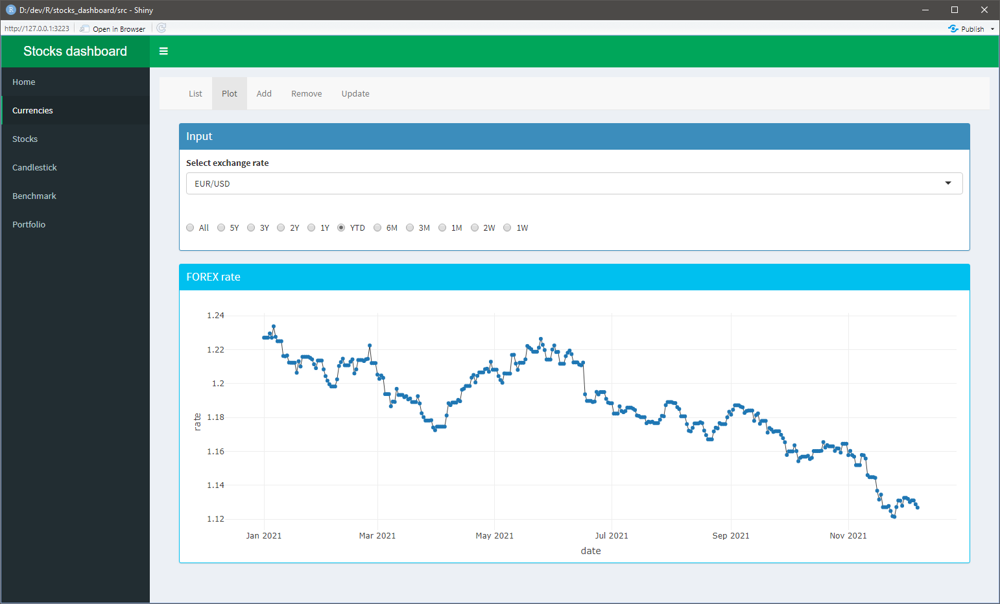
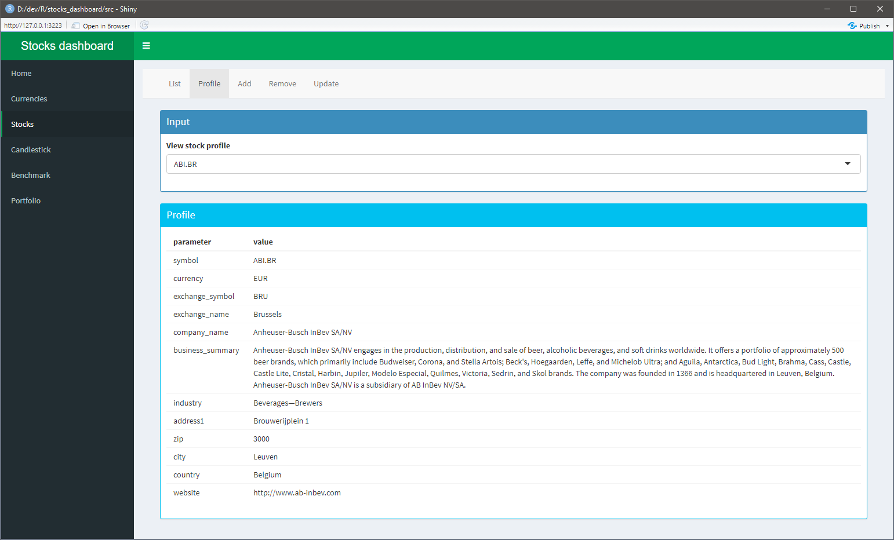
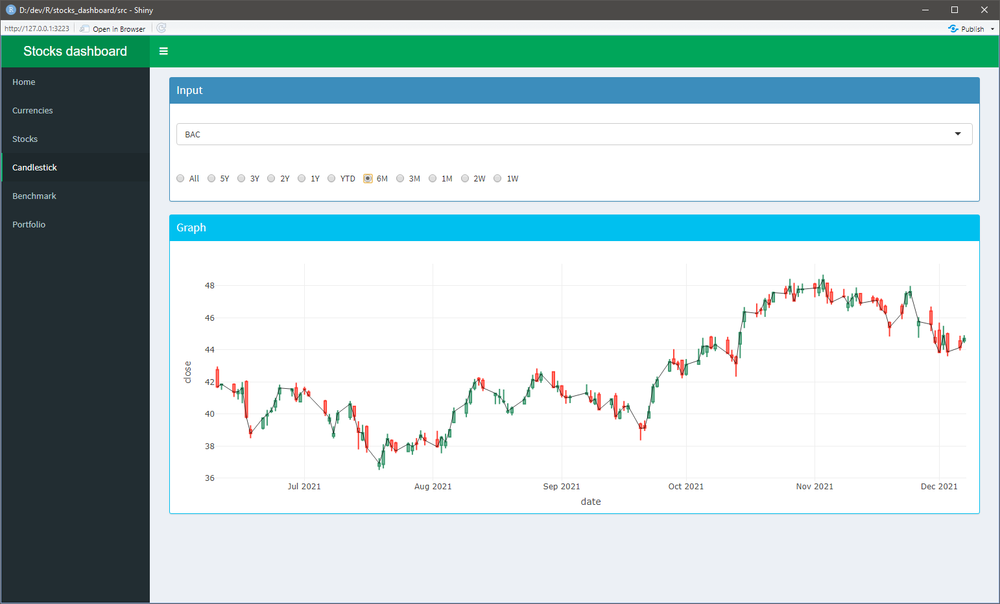
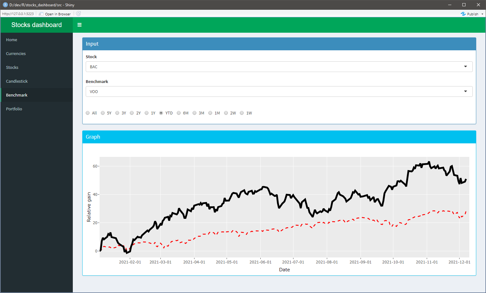
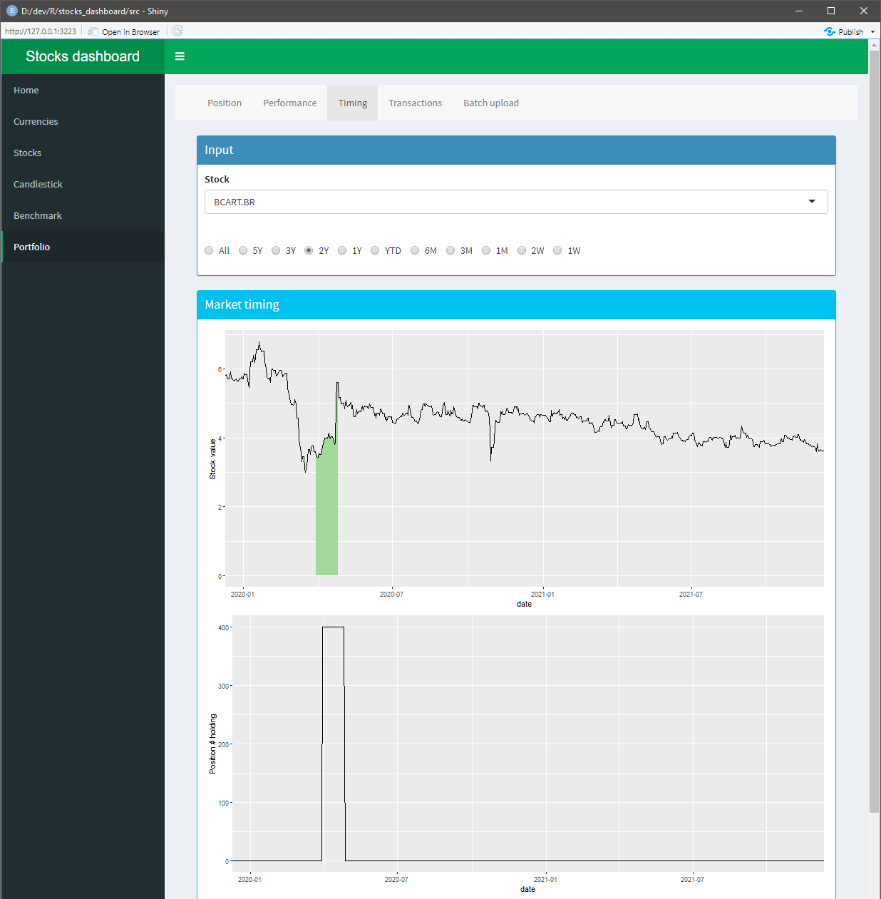

# Stocks_Dashboard
Dashboard to track stock OHLC, FX, and portfolio

## Learnings
This is a hobby project to get familiar with
* R shiny & shinydashboard + proper use of reactivity
* RSqlite interface (& DBI)
* dplyr syntax & it's application on sqlite (dbplyr)
* quantmod package (Yahoo OHLC API)
* querying rapidapi using httr & rjson
* plotly for interactive charts
* using env files for secrets

## Todo
* Show portfolio performance using modified Dietz method
* Dockerize

## How to install the dashboard
* Clone the repo
* Restore the RENV environment (currently built using R4.2.2)
* Run setup scripts
* Run app.R

More information is to be found in `doc/stock_dashboard_documentation.pptx`

## Features & screenshots
The tool can list currencies exchange rates:

 

The tool also contains profile & OHLC data for desired stocks:

 

The tool can plot stock OHLC data in a candlestick chart.

 

The tool can benchmark one stocks performance to another over various timeframes.

 

The tool can show your market timing visually.

 
  
  
